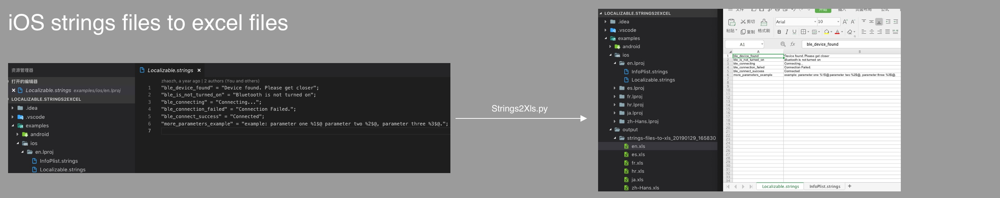
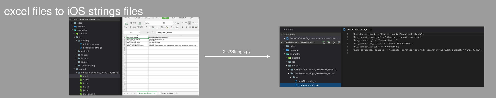
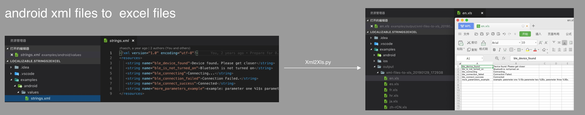

# Localizable.strings2Excel

iOS 本地化文件（.strings）与 Excel 互相转换 & android 的 strings.xml 与 Excel 互相转换 & iOS 本地化文件 转换成 android 的 strings.xml 文件的 Python 脚本工具

## 特性

- [x] 支持将 **iOS** strings 文件转换成 **excel** 文件
- [x] 支持将 **excel** 文件转换成 **iOS** strings 文件
- [x] 支持将 **android** xml 文件转换成 **excel** 文件
- [x] 支持将 **excel** 文件转换成 **android** xml 文件
- [x] 支持将 **iOS** strings 文件转换成 **android** xml 文件

## 当前版本

**V1.0.0**

## 所需环境

### 1.检查 python 版本

python 版本必须是 2.x

```
$ python --version
Python 2.7.10
```

### 2.检查 pip(python 包管理器)

```
$ pip --version
pip 19.0 from /Library/Python/2.7/site-packages/pip (python 2.7)
```

如果没有安装 pip

```
curl https://bootstrap.pypa.io/get-pip.py -o get-pip.py
sudo python get-pip.py
```

### 3.安装 pyexcelerator

```
sudo pip install pyExcelerator
```

### 4.安装 xlrd

```
sudo pip install xlrd
```

## 使用说明

### 1.将 **iOS** strings 文件转换成 **excel** 文件

```
$ python python/Strings2Xls.py -f examples/ios/ -t examples/output
Start converting
Convert examples/ios/ successfully! you can see xls file in examples/output/strings-files-to-xls_20190129_165830
```



### 2.将 **excel** 文件转换成 **iOS** strings 文件

```
$ python python/Xls2Strings.py -f examples/output/strings-files-to-xls_20190129_165830/ -t examples/ou
tput/

options: {'fileDir': 'examples/output/strings-files-to-xls_20190129_165830/', 'targetDir': 'examples/output/', 'excelStorageForm': 'multiple', 'additional': None
}, args: []

Start converting
Convert examples/output/strings-files-to-xls_20190129_165830/ successfully! you can see strings file in examples/output//xls-files-to-strings_20190129_171146
```



### 3.将 **android** xml 文件转换成 **excel** 文件

```
$ python python/Xml2Xls.py -f examples/android/ -t examples/output

options: {'fileDir': 'examples/android/', 'targetDir': 'examples/output', 'excelStorageForm': 'multiple'}, args: []

Start converting
Convert examples/android/ successfully! you can see xls file in examples/output/xml-files-to-xls_20190129_172938
```



### 4.将 **excel** 文件转换成 **android** xml 文件

```
$ python python/Xls2Xml.py -f examples/output/xml-files-to-xls_20190129_172938/ -t examples/output/

options: {'fileDir': 'examples/output/xml-files-to-xls_20190129_172938/', 'targetDir': 'examples/output/', 'excelStorageForm': 'multiple', 'additional': None}, args
: []

Start converting
Convert examples/output/xml-files-to-xls_20190129_172938/ successfully! you can xml files in examples/output//xls-files-to-xml_20190129_174207
```


### 5.将 **iOS** strings 文件转换成 **android** xml 文件

```shell
$ python python/Strings2Xml.py -f examples/ios/en.lproj/ -t examples/output/

options: {'fileDir': 'examples/ios/en.lproj/', 'targetDir': 'examples/output/', 'additional': None}, args: []


Creating android file:examples/output//strings-files-to-xml_20190129_164122/Localizable.xml


Creating android file:examples/output//strings-files-to-xml_20190129_164122/InfoPlist.xml


Convert successfully! you can see xml files in examples/output//strings-files-to-xml_20190129_164122

```


## ChangeLog

[ChangeLog](https://github.com/CatchZeng/Localizable.strings2Excel/blob/master/CHANGELOG.md)

## 贡献者

- [CatchZeng](https://github.com/CatchZeng)
- [Buguibu](https://github.com/buguibu)
- [vgutierrezNologis](https://github.com/vgutierrezNologis)
- [linguinan](https://github.com/linguinan)
- [qiusuo8](https://github.com/qiusuo8)
- [light-bo](https://github.com/light-bo)
- [bryant1410](https://github.com/bryant1410)
