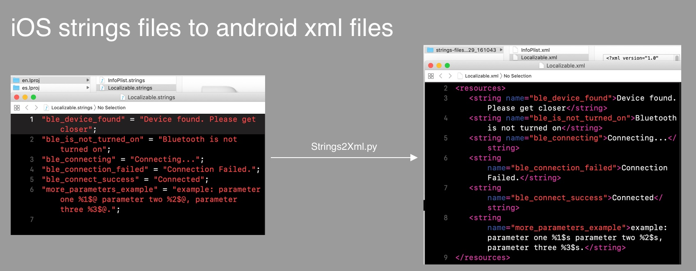

# Localizable.strings2Excel

Python command line tool for conversion between iOS strings files and excel files & between android strings.xml files and excl files. & strings files to android strings.xml files.

[中文请点击](https://github.com/CatchZeng/Localizable.strings2Excel/blob/master/README-CN.md)

## Features

- [x] Support convert **iOS** strings files to **excel** files.
- [x] Support convert **excel** files to **iOS** strings files.
- [x] Support convert **android** xml files to **excel** files.
- [x] Support convert **excel** files to **android** xml files.
- [x] Support convert **iOS** strings files to **android** xml files.

## Required

### 1.Check python version

python version must be 2.x.

```
$ python --version
Python 2.7.10
```

### 2.Check pip(python package manager)

```
$ pip --version
pip 19.0 from /Library/Python/2.7/site-packages/pip (python 2.7)
```

if pip is not installed

```
curl https://bootstrap.pypa.io/get-pip.py -o get-pip.py
sudo python get-pip.py
```

### 3.Install pyexcelerator

```
sudo pip install pyExcelerator
```

### 4.Install xlrd

```
sudo pip install xlrd
```

## Usage

### 5. convert **iOS** strings files to **android** xml files.

```shell
$ python python/Strings2Xml.py -f examples/ios/en.lproj/ -t examples/output/

options: {'fileDir': 'examples/ios/en.lproj/', 'targetDir': 'examples/output/', 'additional': None}, args: []


Creating android file:examples/output//strings-files-to-xml_20190129_164122/Localizable.xml


Creating android file:examples/output//strings-files-to-xml_20190129_164122/InfoPlist.xml


Convert successfully! you can see xml files in examples/output//strings-files-to-xml_20190129_164122

```



## ChangeLog

[ChangeLog](https://github.com/CatchZeng/Localizable.strings2Excel/blob/master/CHANGELOG.md)

## Thanks

- [Buguibu](https://github.com/buguibu)
